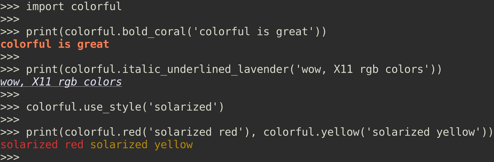

# colorful

[](https://travis-ci.org/timofurrer/colorful)
[](https://codecov.io/github/timofurrer/colorful?branch=master)
[](https://badge.fury.io/py/colorful)
[](https://pypi.python.org/pypi/colorful)
[](https://pypi.python.org/pypi/colorful)

Terminal string styling done right, in Python :tada:

## Here's a tease



```python
import colorful

# create a colored string using clever method translation
print(colorful.bold_white('Hello World'))
# create a colored string using `str.format()`
print('{c.bold}{c.lightCoral_on_white}Hello World{c.reset}'.format(c=colorful))

# nest colors
print(colorful.red('red' + colorful.white(' white ', nested=True) + 'red'))
print(colorful.red('red {0} red'.format(colorful.white('white', nested=True))))

# use true colors
colorful.use_true_colors()

# extend default color palette
colorful.update_palette({'mint': '#c5e8c8'})
print(colorful.mint_on_snow('Wow, this is actually mint'))

# choose a predefined style
colorful.use_style('solarized')
# print the official solarized colors
print(colorful.yellow('yellow'), colorful.orange('orange'), 
    colorful.red('red'), colorful.magenta('magenta'),
    colorful.violet('violet'), colorful.blue('blue'),
    colorful.cyan('cyan'), colorful.green('green'))

# choose specific color mode for one block
with colorful.with_8bit_ansi_colors() as c:
    print(c.bold_green('colorful is awesome!'))

# create and choose your own color palette
MY_COMPANY_PALETTE = {
    'companyOrange': '#f4b942',
    'companyBaige': '#e8dcc5'
}
with colorful.with_palette(my_company_palette) as c:
    print(c.companyOrange_on_companyBaige('Thanks for choosing our product!'))
```

## Key Features

* expressive and consistent API ([docs](#style-a-string))
* support for different color modes (8bit ANSI, 256 ANSI, true colors) ([docs](#color-modes))
* support for predefined awesome styles (solarized, ...) ([docs](#styles))
* support for custom color palettes ([docs](#color-palette))
* support nesting styles ([docs](#nesting-styles))
* support for different platforms (using colorama on windows)
* context managers for clean color mode, color palette or style switch ([docs](#temporarily-change-colorful-settings))
* support `len()` on colored strings ([docs](#correctly-support-the-len-protocol))
* no dependencies

## Usage

**colorful** supports all major Python versions: *2.7*, *3.2*, *3.3*, *3.4*, *3.5* and *3.6*. <br>
We recommend to use the latest version released on [PyPI](https://pypi.python.org/pypi/colorful):

```bash
pip install colorful
```

*Note: on a Windows system it will install ``colorama`` as a dependency to ensure proper ANSI support.*

**colorful** does not require any special setup in order to be used:

```python
import colorful

print(colorful.italic_coral_on_beige('Hello World'))
print('{c.italic_coral_on_beige}Hello World{c.reset}'.format(c=colorful))
```

### Color modes

These days terminals not only support the ancient 8 bit ANSI colors but often they support up to 16 Million colors with *[true color](https://en.wikipedia.org/wiki/Color_depth#True_color_.2824-bit.29)*. And if they don't support *true color* they might support the *[256 ANSI color palette](https://en.wikipedia.org/wiki/ANSI_escape_code#Colors)* at least.

**colorful** supports the following color modes:

* no colors / disable (``colorful.NO_COLORS``)
* 8 colors -> 8 bit ANSI colors (``colorful.ANSI_8BIT_COLORS``)
* 256 colors -> 256 ANSI color palette (24bit ``colorful.ANSI_256_COLORS``)
* 16'777'215 colors -> true color (``colorful.TRUE_COLORS``)

By default *colorful* tries to auto detect the best supported color mode by your terminal. Consult [`colorful.terminal`](https://github.com/timofurrer/colorful/blob/master/colorful/terminal.py) for more details.

However, sometimes it makes sense to specify what color mode should be used.<br>
**colorful** provides multiple ways to do so: 

#### (1) specify color mode globally via Python API

```python
colorful.disable()
colorful.use_8bit_ansi_colors()
colorful.use_256_ansi_colors()
colorful.use_true_colors()
```

If you change the color mode during runtime it takes affect immediately and globally. 

#### (2) enforce color mode globally via environment variable

```bash
COLORFUL_DISABLE=1 python eggs.py  # this process will not use ANY coloring
COLORFUL_FORCE_8BIT_COLORS=1 python eggs.py  # this process will use 8 bit ANSI colors by default
COLORFUL_FORCE_256_COLORS=1 python eggs.py  # this process will use 256 ANSI colors by default
COLORFUL_FORCE_TRUE_COLORS=1 python eggs.py  # this process will use true colors by default
```

#### (3) specify color mode locally via Python API (contextmanager)

```python
with colorful.with_8bit_ansi_colors() as c:
    print(c.italic_coral_on_beige('Hello world'))
    
with colorful.with_256_ansi_colors() as c:
    print(c.italic_coral_on_beige('Hello world'))
    
with colorful.with_true_colors() as c:
    print(c.italic_coral_on_beige('Hello world'))
```

### Color palette

**colorful**'s Python API is based on *color names* like in `colorful.bold_white_on_black('Hello')`. During runtime these *color names* are translated into proper [ANSI escape code](https://en.wikipedia.org/wiki/ANSI_escape_code) sequences supported by the *color mode* in use. However, all *color names* are registered in a **color palette** which is basically a mapping between the *color names* and it's corresponding RGB value. Very much like this:

```python
color_palette_example = {
    'black': '#000000',
    'white': '#FFFFFF',
}
```

*Note: Depending on the color mode which is used the RGB value will be reduced to fit in the value domain of the color mode.*

The default color palette is the [X11 rgb.txt](https://en.wikipedia.org/wiki/X11_color_names) palette - it's shipped with *colorful*, thus, you don't have to provide your own.

**colorful** supports to update or replace the default color palette with custom colors. The colors have to be specified as RGB hex or channel values:

```python
# corporate identity colors
ci_colors = {
    'mint': '#c5e8c8',  # RGB hex value
    'darkRed': '#c11b55',  # RGB hex value
    'lightBlue': (15, 138, 191)  # RGB channel triplet
}

# replace the default palette with my custom one
colorful.use_palette(ci_colors)
# update the default palette with my custom one
colorful.update_palette(ci_colors)

# we can use these colors
print(colorful.italic_mint_on_darkRed('My company'))
```

### Styles

**colorful** supports some famous color palettes using what's called *styles* in colorful:

```python
colorful.use_style('solarized')

# print the official solarized colors
print(colorful.yellow('yellow'), colorful.orange('orange'), 
    colorful.red('red'), colorful.magenta('magenta'),
    colorful.violet('violet'), colorful.blue('blue'),
    colorful.cyan('cyan'), colorful.green('green'))
```

The following styles are already supported:

<details>
 <summary>solarized - <a href="http://ethanschoonover.com/solarized">Website</a></summary>
 <br>
 
</details>
<details>
 <summary>monokai</summary>
 <br>
 
</details>
<br>

*Note: if you know some awesome color palettes which could be a new style in colorful, please contribute it!*

### Style a string

**colorful** provides multiple ways to use style a string. Most useful and expressive is probably the *method syntax* where you specify the modifiers and colors in the method name itself and pass the string as argument to this method. However, you can also [`colorful.format()`](#2-style-a-string-with-colorfulformatstring-args-kwargs) or [`str.format()`](#3-style-a-string-with-strformat).

#### (1) Style a string with a method call `colorful.[<modifiers...>]_[<fgColor>]_[on_<bgColor>](str, nested=False)`

```python
print(colorful.red('I am red'))
print(colorful.italic_yellow('I am italic and yellow'))
print(colorful.black_on_white('I am black on white'))
```

The method syntax can be one of:

* `colorful.<modifier>`
* `colorful.<modifier1>_<modifier2>`
* `colorful.<fg_color>`
* `colorful.on_<bg_color>`
* `colorful.<modifiers>_<fg_color>`
* `colorful.<modifiers>_<bg_color>`
* `colorful.<fg_colors>_on_<bg_color>`
* `colorful.<modifiers>_<fg_color>_on_<bg_color>`

*Note that multiple `<modifier>`s can be specified at once.*

Available modifiers are:

* reset (explicitely reset all styles before the passed argument)
* bold
* dimmed (not widely supported)
* italic
* underlined
* blinkslow
* blinkrapid
* inversed (not widely supported)
* concealed (not widely supported)
* struckthrough

The available colors depend on the [color palette](#color-palette) you are using. By default all [X11 rgb.txt colors](https://en.wikipedia.org/wiki/X11_color_names) are available.

The type of the return value of such a *style method* is `colorful.ColorfulString`. It correctly supports all `str()` methods including [`len()`](#correctly-support-the-len-protocol).

As you can see from the syntax in the section name, **colorful** supports nesting styles. See [Nesting styles](#nesting-styles).

#### (2) Style a string with `colorful.format(string, *args, **kwargs)`

```python
print(colorful.format('{c.red}I am {what}{c.close_fg_color}', what='red'))
# alternatively to ``c.close_fg_color`` you can reset every style with ``c.reset``
print(colorful.format('{c.red}I am red{c.reset}'))

print(colorful.format('{c.italic_yellow}I am italic and yellow{c.no_italic}{c.close_fg_color}'))
print(colorful.format('{c.black_on_white}I am black on white{c.close_fg_color}{c.close_bg_color}'))
```

**colorful** will replace the `{c.<style>}` with the correspnding style. It's **not** necessary to pass a colorful object for `c` to `format()` - colorful will handle that. Every other format argument (`{<name>}`) has to be pass to the `colorful.format()` call as *args* or *kwarg*.

Note: The same syntax, modifiers and colors for the style in `{c.<style>}` can be used as for [(1) Style a string with a method call](#1-style-a-string-with-a-method-call).

#### (3) Style a string with [`str.format()`](https://docs.python.org/3.6/library/stdtypes.html#str.format)

```python
print('{c.red}I am red{c.close_fg_color}'.format(c=colorful))
# alternatively to ``c.close_fg_color`` you can reset every style with ``c.reset``
print('{c.red}I am red{c.reset}'.format(c=colorful))

print('{c.italic_yellow}I am italic and yellow{c.no_italic}{c.close_fg_color}'.format(
    c=colorful))
print('{c.black_on_white}I am black on white{c.close_fg_color}{c.close_bg_color}'.format(
    c=colorful))
```

Note: The same syntax, modifiers and colors for the style in `{c.<style>}` can be used as for [(1) Style a string with a method call](#1-style-a-string-with-a-method-call).

#### Nesting styles

**colorful** supports to nest styles with it's [method call syntax](#1-style-a-string-with-a-method-call) when setting the paramter `nested` to `True`.

The following examples show the behavior:

```python
print(colorful.red('red' + colorful.white(' white ', nested=True) + 'red'))
print(colorful.red('red {0} red'.format(colorful.white('white', nested=True))))

# if using ``nested=True`` but you don't actually nest 
# it's absolutely fine and will work as expected.
print(colorful.red('red', nested=True) + ' default color')
```

#### Correctly support the [`len()` protocol](https://docs.python.org/3/library/functions.html#len)

**colorful** correctly supports the `len()` protocol (`__len__`) on the styled strings. As mentioned above, when you style a string a `colorful.ColorfulString` object is returned. This object returns the length (when calling `len()`) as it would be for the *unstyled string* to integrate styled strings seemlessly into your application.

```python
>>> s = 'Hello World'
>>> len(s)
11
>>> len(colorful.yellow(s))
11
>>> assert len(s) == len(colorful.yellow(s))
```

### Temporarily change colorful settings

**colorful** provides a hand full of convenient context managers to change the colorful settings temporarily:

#### (1) change color mode

Use 8 bit colors:

```python
with colorful.with_8bit_ansi_colors() as c:
    print(c.red('I am red'))
```

Use 256 colors:

```python
with colorful.with_256_ansi_colors() as c:
    print(c.red('I am red'))
```

Use true colors:

```python
with colorful.with_true_colors() as c:
    print(c.red('I am red'))
```

#### (2) change color palette

```python
# replace the entire color palette
with colorful.with_palette(my_palette) as c:
    print(c.customRed('I am custom red'))

# update the color palette
with colorful.with_updated_palette(my_palette) as c:
    print(c.customRed('I am custom red'))
```

#### (3) change style

```python
with colorful.with_style('solarized') as c:
    print(c.red('I am solarized red'))
```

***

*<p align="center">This project is published under [MIT](LICENSE).<br>A [Timo Furrer](https://tuxtimo.me) project.<br>- :tada: -</p>*
